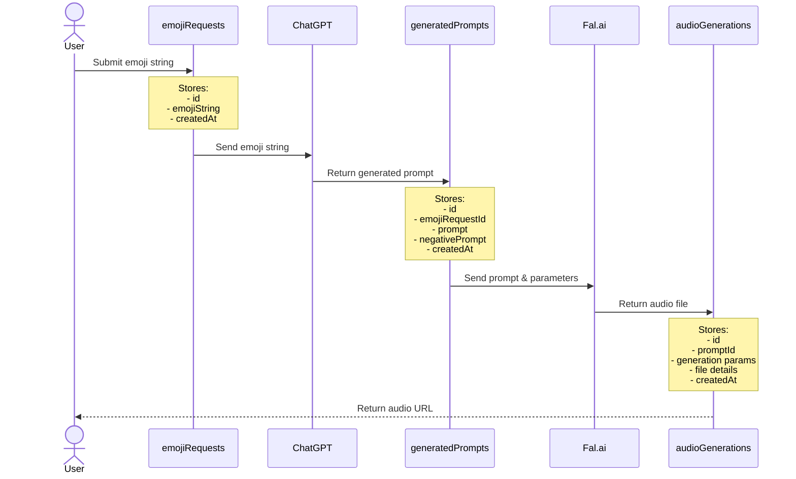

# SoundMoji 🎵

## Description

This is a simple game where you can select multiple emojis and generate a sound from that.

## How it works

## Flow

```mermaid
    sequenceDiagram
        actor User
        participant DB1 as emojiRequests
        participant GPT as ChatGPT
        participant DB2 as generatedPrompts
        participant FAL as Fal.ai
        participant DB3 as audioGenerations

        User->>DB1: Submit emoji string
        Note over DB1: Stores: <br/>- id<br/>- emojiString<br/>- createdAt

        DB1->>GPT: Send emoji string
        GPT->>DB2: Return generated prompt
        Note over DB2: Stores: <br/>- id<br/>- emojiRequestId<br/>- prompt<br/>- negativePrompt<br/>- createdAt

        DB2->>FAL: Send prompt & parameters
        FAL->>DB3: Return audio file
        Note over DB3: Stores: <br/>- id<br/>- promptId<br/>- generation params<br/>- file details<br/>- createdAt

        DB3-->>User: Return audio URL
```

